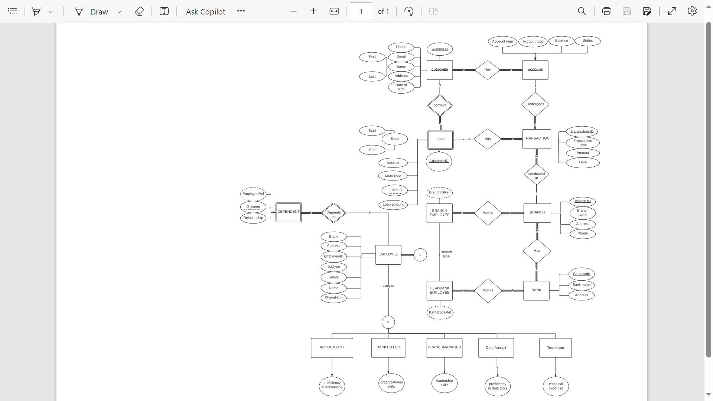

# Bank Management System Database

**Course:** CMPS 244, American University of Beirut

## Abstract

The goal of this project is to create a database management system for a fictitious bank that will store information about customers, accounts, transactions, loans, branches, and employees. The system will provide a user-friendly interface for bank employees and customers to access and manage this information.

## Schema

Our database will consist of the following tables and their respective attributes:

- Employee(Employee_ID integer (primary key), Bdate date, Address varchar(255), Jobtype varchar(255), Salary float, Name varchar(255), PhoneNum integer)
- Dependent(Dependent_ID integer (primary key), D_Name varchar(255), Relationship varchar(255), EmployeeID integer (foreign key references Employee.Employee_ID))
- Accountant(Employee_ID integer (primary key, foreign key references Employee.Employee_ID), Proficiency string)
- Technician(EmployeeID integer (primary key, foreign key references Employee.Employee_ID), Technical_Expertise varchar(255))
- Data_Analyst(Employee_ID integer (primary key, foreign key references Employee.Employee_ID), Proficiency_in_tools varchar(255))
- Bank_Teller(Employee_ID integer (primary key, foreign key references Employee.Employee_ID), Organizational_skills varchar(255))
- Customer(Customer_ID integer (primary key), PhoneNum integer, Email varchar(15), First_Name varchar(255), Last_Name varchar(255), Address varchar(255), Date_Of_Birth date)
- Bank(Bank_Code integer (primary key), Bank_Name varchar(255), Address varchar(255))
- Account(Account_Num integer (primary key), Account_Type varchar(255), Balance float, Status varchar(255), CustomerID integer (foreign key references Customer.Customer_ID))
- Transaction(Transaction_ID integer (primary key), Transaction_Type varchar(255), Amount float, Date date, Account_Num integer (foreign key references Account.Account_Num))
- Branch(Branch_ID integer (primary key), Branch_Name varchar(255), Address varchar(255), PhoneNum integer)
- Loan(Loan_ID integer (primary key), CustomerID integer (foreign key references Customer.Customer_ID))
- Transaction_Branch(Transaction_ID integer (foreign key references Transaction.Transaction_ID), Branch_ID integer (foreign key references  Branch\.Branch_ID))
- Head_Bank_Employee(Employee_ID integer (foreign key references Employee.Employee_ID), Bank_Code integer (foreign key references Bank.Bank_Code))
- Branch_Employee(Branch_ID integer (foreign key references Branch\.Branch_ID), Employee_ID integer (foreign key references Employee.Employee_ID))
- Branch_Manager(EmployeeID integer (foreign key references Employee.Employee_ID), Branch_ID integer (foreign key references Branch\.Branch_ID), Branch_Manager varchar(255))

## Views

In addition to the tables, the following views have been created to provide a more user-friendly interface to the database:

- Customer_Accounts: This view lists all the accounts associated with each customer, along with their balance and status.
- Employee_Details: This view lists all the details of each employee, including their name, job type, and salary.
- Branch_Transactions: This view lists all the transactions that have taken place at each branch, along with the date, type, and amount of the transaction.

## Indexes

The following indexes have been created in order to optimize the performance of the database:

- Index on Employee.Employee_ID
- Index on Dependent\.Dependent_ID
- Index on Customer.Customer_ID
- Index on Bank.Bank_Code
- Index on Account.Account_Num
- Index on Transaction.Transaction_ID
- Index on Branch\.Branch_ID
- Index on Loan.Loan_ID

## Usage

To use this database, you will first need to set up a PostgreSQL server. Once you have done so, you can create a new database and import the schema and data from the provided SQL files. After that, you can use a variety of SQL queries to interact with the database and retrieve the information you need.

## Contributions

If you would like to contribute to this project, please fork the repository and create a new branch for your changes. Once you have made your changes, submit a pull request and we will review your changes and merge them into the main branch if they are accepted.

## EER Model

